class: center
name: title
count: false

# Rust: when the details matter

.p60[]

.me[.grey[*by* **Nicholas Matsakis**]]
.left[.citation[View slides at `https://nikomatsakis.github.io/eurorust-2023/`]]

---

# Who am I?

.row[
.column40[]
.column60[
* Involved in Rust since 2010
* Co-lead of Rust language design, types teams
* Rust team at Amazon
]
]

???

Hi! My name is Niko Matsakis. I've been working in Rust a long time, and so I expect some of you know who I am already, but for the rest of y'all, let me introduce myself.

I started working on Rust in 2010. I was involved in the very first public release of Rust, 0.1. We've come a long way since those days! As one tiny exmaple, when I started, Rust was 32-bit only. My first contribution, as I recall, was implementing support for 64-bit systems. Good times. Since then, I've been involved in a lot of other things. I was the first lead of the Rust compiler team and was involved in the Rust core team, back when that was a thing. At this point though my primary role is as co-lead of the Rust language design team.

Since 2021, I've been working at Amazon, where I manage our Rust team. This is a team of folks whose full-time job is to contribute to the Rust project, Tokio, and other parts of the ecosystem. As some of you may know, Amazon's been making very heavy use of Rust. At this point, every S3 GET request, every Lambda invocation, and a good number of other things make use of services implemented in Rust. Being at Amazon has been a really interesting experience, since it lets me work very closely with the teams here, figuring out exactly where Rust can help them -- and where it holds them up. We can then take those lessons, mix them with the experiences of others in other contexts, and find ways to make Rust better for everyone.

---

# Rust adoption

## Daily downloads

.p100[]

## Number of users/teams owning a crate

.p100[]

.footnote[
    Images from [lib.rs/stats](https://libs.rs/stats)
]

???

The last 10 years have been a wild ride! 

Rust has gone from this little toy language to a key part of the industry.

When I said I work on Rust, people used to give me a weird look. "I thought you said you were a programmer. Are you a chemist?"

Not so true anymore. More and more, people tend to respond, "Oh, hey, we're using Rust for something at work!" 

---

# Rust adoption

.p80[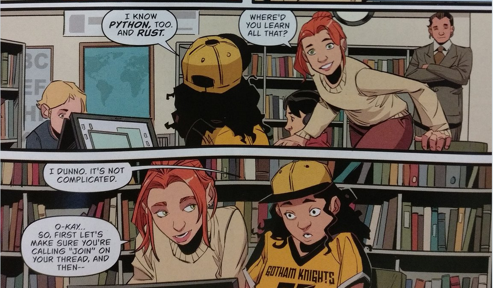]

???

Of course, the watershed moment was when Rust appeared in the batgirl comic in 2017.
Boom, our job is done!

--

.batgirlcircle[&nbsp;]

???

Oh, and I'd like to callout that she says Rust is not complicated. Thanks batgirl comic authors! 
I like this PR.

---

# Rust adoption

* Rust in the cloud

???

We are seeing Rust in the cloud. Both to build the cloud itself, like at (hello!) Amazon and Microsoft, but also to build things *in* the cloud. A lot of people are finding that writing their cloud apps in Rust is a good choice. It saves them money. It requires less beefy machines and runs more reliably. 

--

* Rust in kernels

???

We are seeing Rust in kernels -- Rust for linux? Amazing. Windows kernel? Amazing. 

Rust was designed to be versatile, usable for high-level and low-level applications alike, and seeing it stretch from the machine kernel up to distributed applications in the cloud is a really cool validation of that design.

--

* Rust in **your** workplace?

???

For more and more people, working in Rust is a reality. 
If you're using Rust in your workplace, I'd love to hear about it after the talk.
But maybe you're not yet, and you'd like to be.
Or maybe you yourself are not convinced, and you'd like to know what all the fuss is about.

---

# Why do people use Rust?

In my experience, this is the wrong question.

???

I want to 

---

# Why do people *start* using Rust?

In a word: **efficiency**

--


???


---

# Why not something else?

In a word: **risky**

--


---

# Why do people *keep* using Rust?

In a word, **reliability**

--

.p40[]

---

# I'm not the first to observe this

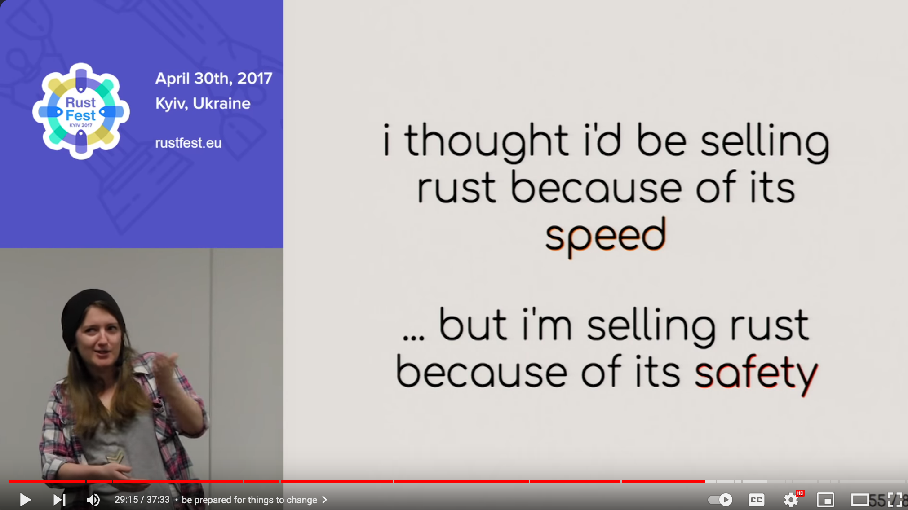

???

Now, I'm not the first to see this. There's a great presentation by Ashley Williams -- speaking tomorrow at this conference! -- talking about her experience advocating for Rust at npm, and she makes the same observation.

By the way, if you're one of those people who would like to see Rust being used at their workplace, but isn't sure how to advocate for it, I recommend checking out her talk -- it's great!

---

# What's next for Rust?

.p80[]

---

# The Rust 2024 Edition is coming


???

---

# Rust editions in a nutshell

"Breaking changes where no code breaks"

* Every crate declares its *Rust edition* (e.g., `edition = "2024"`)

--
* Compiler understands *all* editions

--
* Editions interoperate (we never split the ecosystem)

--
* Adopting the newest edition is automated
    * Just run `cargo fix --edition`

--

What all this means:

* Upgrade on **your schedule, not ours**
    * (and not your dependencies' either)

---

### Rust editions let us make good on our promises...

# "Stability without stagnation"

???

Ever since 1.0, we've had "stability without stagnation" as one of our goals.

In short, we want to offer you a stable, reliable platform to build on.

But we also know that anything which *stands still* eventually bitrots and dies.

So we want Rust to keep evolving.

We resolve this tension in a bunch of ways.

It's one of the reasons we have a minimal standard library, preferring instead to let the ecosystem evolve.

It's why we do rolling releases every 6 weeks, which is pretty unusual for a programming language.

And it's why we do editions, which let us fix our mistakes, but don't force you to pay for them.

---

# Rust editions are also an opportunity to reflect

"Gather round Rustaceans, and I'll tell you a tale"

.p60[]

---

# Let-else

.p60[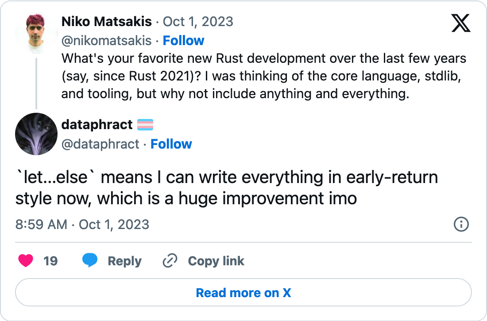]

---

# Let-else

.p60[]

--
.p60[]
.p60[]
.p60[]

---

name: before-let-else

# Before let-else

```rust
fn process_data() -> Option<Data> { }

fn make_decision() -> bool {
    if let Some(data) = process_data() {
        do_stuff_with(data)
    } else {
        false
    }
}
```

---

template: before-let-else

.line1[]

---

template: before-let-else

.line4[]

---

template: before-let-else

.line7[]

---

template: before-let-else

.line5[]

---
name: after-let-else

# After let-else

```rust
fn process_data() -> Option<Data> { }

fn make_decision() -> bool {
    let Some(data) = process_data() else {
        return false;
    };

    do_stuff_with(data)
}
```

---
template: after-let-else

.elsekw[]

???

Now you can put this `else` keyword...

---
template: after-let-else

.line5[]

???

...and you can move the "unlikely case" here

---
template: after-let-else

.line8[]

???

...with the happy path being unindented.

---

# How an idea becomes a feature

.pathrfc[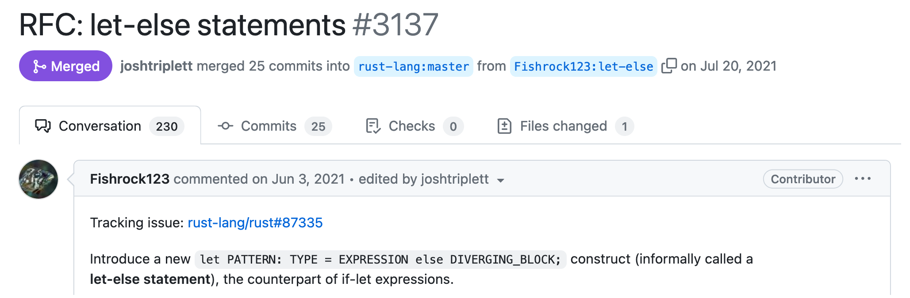]

--
.pathrfcimpl[]
.pathimpl[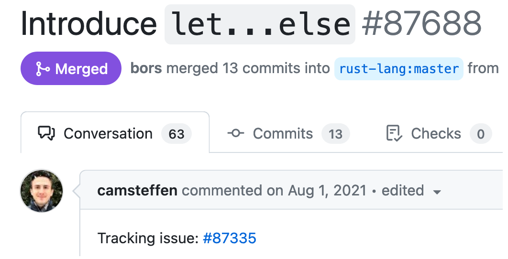]

--
.pathimplstab[]
.pathstab[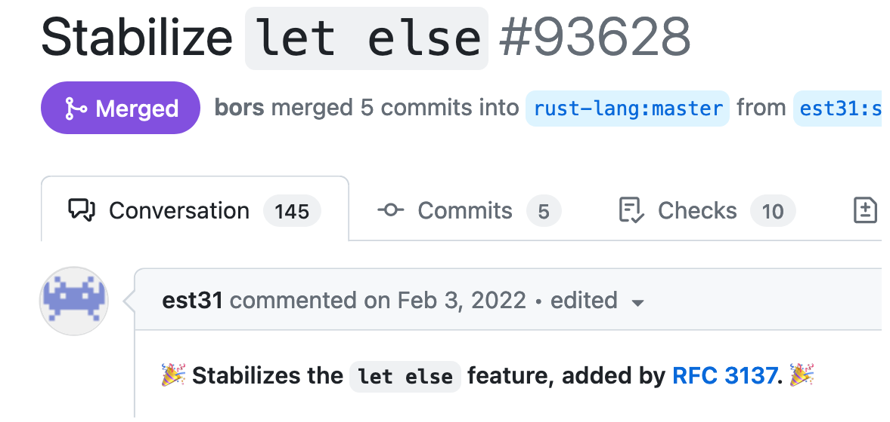]

--

.pathdocs[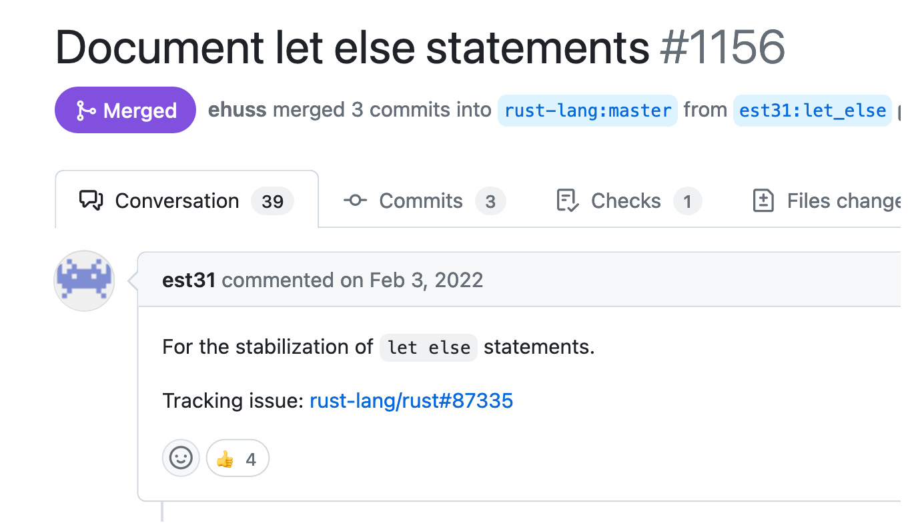]

--

.pathtemps[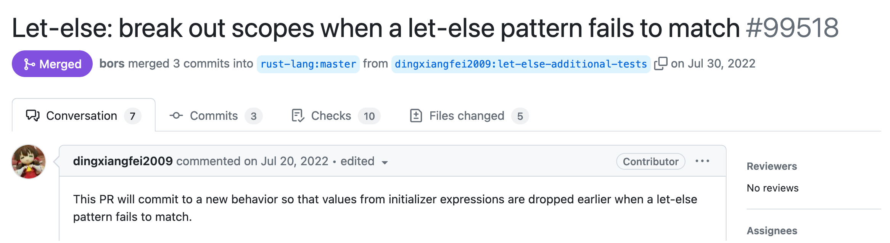]

--

.pathfmt[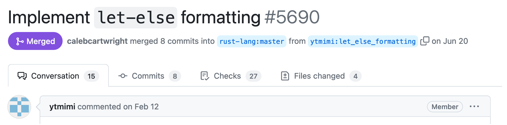]

--

.pathstabfcp[]
.pathfcp[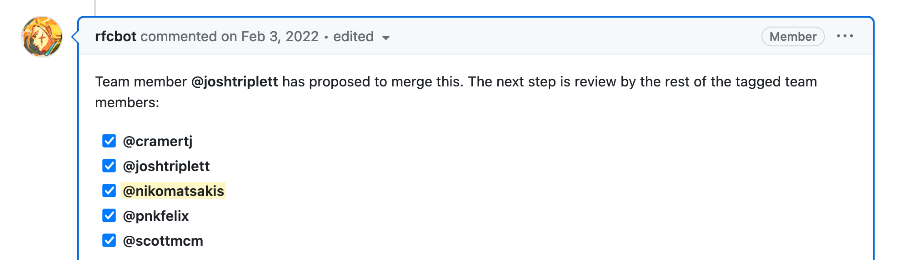]

---

# Credit where credit is due

.pathcredit[.thanks[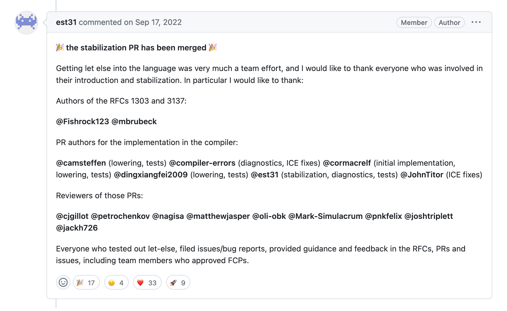]]

--

.credit1[]
.credit2[]
.credit3[]

--

.pathcredit2[
...plus `@ytmimi` who wrote the rustfmt impl!
]
.credit4[]

---

# More goodness

.p48[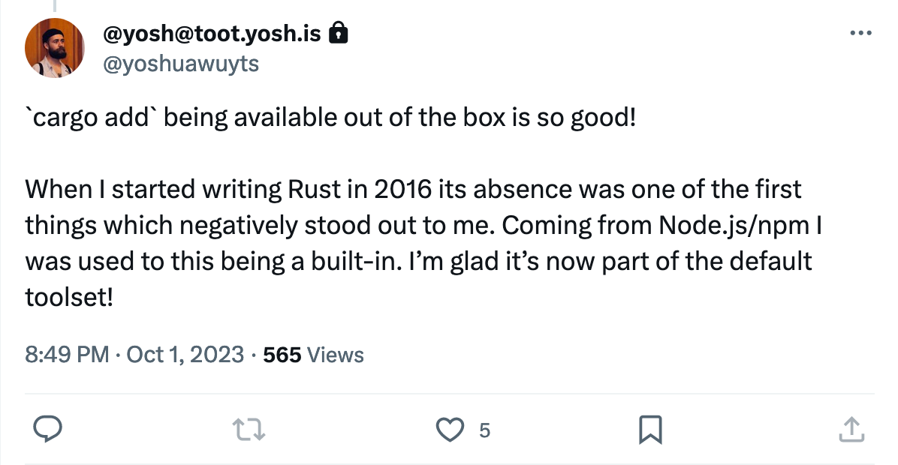]

--
.p48[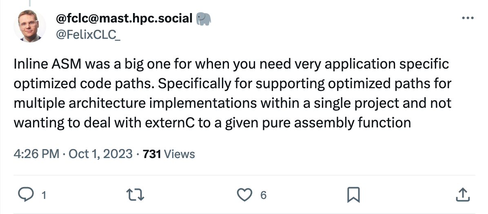]

--
.p48[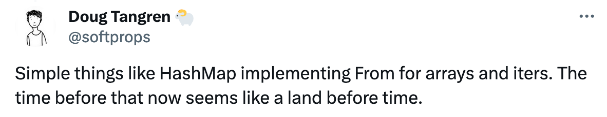]

--
.p48[]


--
.p48[]

---

# And my personal favorite...

.p80[]

.footnote[
    Consider the rust-analyzer [Open Collective](https://opencollective.com/rust-analyzer).
]

---

name: async-io

# Async I/O in Rust

Ever since Rust 1.39 was released in Nov 2019...

```rust
async fn handle(r: Request) -> Response {
    ... do_stuff().await ...
}
```

---
template: async-io
name: async-io1

This is actually sugar for...

```rust
fn handle() -> impl Future<Output = Response> {
    async move {
        ... do_stuff().await ...
    }
}
```

---
template: async-io1

.implfuture[]

---
template: async-io1

.asyncbody[]

---

# But async fn and impl Trait are limited

```rust
trait Handler {
    async fn handle(r: Request) -> Response; // 💥
}

trait Handler {
    fn handle(r: Request) -> impl Future<Output = Response>; // 💥
}

impl Handler {
    async fn handle(r: Request) -> Response { // 💥
        ... do_stuff().await ...
    }
}
```


.footnote[
    PSA: You can use [the `#[async_trait]` crate](https://crates.io/crates/async-trait) to workaround this today.
]

--

.line2[]

.line6[]

.line10[]

???

But as of today, async functions (and impl Trait return types) can only be used in very limited places. 

In particular, you can't use them in traits. 

This is a major stumbling block for new users, who innocently write the syntax only to get an error.

There is a workaround: there's a crate that you can use to simulate async functions in traits, and the compiler even suggests it.

That's ok, but (a) you really shouldn't have to reach for a crate for core functionality like this

and (b) the techniques the async-trait crate uses are not workable for all scenarios. 

Lack of async fn in traits is a big blocker to the development of a rich async ecosystem.

Crates like Tower, which defines a generic middleware interface, are much more complex and not able to reach 1.0 status.

The standard library can't add interop traits for things like reading and writing of streams.

The list goes on.

---
# When Rust 1.75 is released on Dec 28...

```rust
trait Handler {
    fn handle(r: Request) -> impl Future<Output = Response>; // ✅
}
```

--

.line2[]

???

But here's the good news. On Dec 28, when Rust 1.75 comes out,
barring any unforeseen surprises, you are going to be able to write
`-> impl Future` in traits. In fact, you can write any sort of `impl Trait` return type.
So you can have traits that return futures, or traits that return iterators, or closures,
or whatever. Big shout out to Tyler Mandry for driving this work, 
to Michael Goulet for doing the implementation, and to TC for helping with the organizational "ops"
that are needed to push something like this over the finish line. 
Michael -- perhaps better known as compiler-errors -- is here in the audience, even.

---
name: implfutureinimpl
# When Rust 1.75 is released on Dec 28...

```rust
trait Handler {
    fn handle(r: Request) -> impl Future<Output = Response>;
}

impl Handler {
    fn handle(r: Request) -> impl Future<Output = Response> {
        async move {
            ... do_stuff().await ...
        }
    }
}
```

---
template: implfutureinimpl

.line6[]

???

Of course, you can also use impl trait when you implement
the trait.

---
template: implfutureinimpl

.line7[]

Here we see a "desugared" async function, so the body has an `async move` block.

---
# When Rust 1.75 is released on Dec 28...

```rust
trait Handler {
    fn handle(r: Request) -> impl Future<Output = Response>;
}

impl Handler {
    async fn handle(r: Request) -> Response {
        ... do_stuff().await ...
    }
}
```

.line6[]

???

In fact, since async fn is literally just sugar for `-> impl Future`,
you can also write `async fn` in the impl. It works exactly the same,
except that you don't need to have an async block in the body.

---
name: calling

# When Rust 1.75 is released on Dec 28...

```rust
trait Handler {
    fn handle(r: Request) -> impl Future<Output = Response>;
}

async fn handle<H>(h: H, r: Request) 
where
    H: Handler,
{
    h.handle(r).await
}
```

---
template:calling
.line7[]

???

And once you write a trait that uses impl trait, you can write functions that call it, just like any other trait.

---
template:calling
.line9[]

???

In this case, since the function is returning a future, you can call it from an async function
and then await the result. It all works like you expect. 

Now, if you are an experienced async Rust developer, you may be thinking "but I can already use the `#[async_trait]` macro, what's new here?" The answer is that the macro was introducing boxing and dynamic dispatch. This is probably fine for most people, but it can have some performance cost, especially in tight loops, and it's just not the way Rust normally works. The native implementation works like any other trait, so you get static dispatch, no allocation, etc, just as you are used to.

---
# What about `async fn` in traits?

```rust
trait Handler {
    async fn handle(r: Request) -> Response;  // ⚠️
}
```

--

.line3[]

Async functions in traits don't (yet) handle all the use cases we want.

???

I'm sure you're wondering -- ok, so why is the trait desugared?
Can I use async functions in traits?
The answer is YES, you can, but you are going to get a warning. 
That's because while basic support for async functions in traits is done, there are still some upcoming features that we want to see finished before we say that async fn in traits are ready for widespread use.

---

# Limitation 1

### [Send bounds](https://smallcultfollowing.com/babysteps/blog/2023/02/01/async-trait-send-bounds-part-1-intro/)

Upshot:

* You have to hardcode in your trait whether the returned futures are `Send` or not.
    * If you are using a workstealing executor, use `-> impl Future + Send`
    * If you are not, use `async fn` or `-> impl Future`
    * Can't make one trait that fits both use cases perfectly (yet).

???

There are the two key limitations.

The first one is called the "send bound" problem.
I can't cover all the details here, so I've got a link you can read if you want to dive deeper.

The gist of the send bound problem is that, when you define a trait with async function,
the trait has to declare up front whether the future to be returned is `Send` or not.
This means you can't write a single trait that works for all kinds of runtimes.
This means that generic crates like `tower` don't have all the tools they need.

Also, the `async fn` sugar doesn't work well in the most common setup -- using tokio in its default configuration, with a work-stealing executor. For that, you probably want to write `-> impl Future + Send` in your traits.

We have some ideas how to fix this, and we hope to deliver a solution in the short term, hopefully reaching stable very early next year.

---

# Limitation 2

### [Dyn safety](https://smallcultfollowing.com/babysteps/blog/2021/09/30/dyn-async-traits-part-1/)

Upshot:

* No native support for `Box<dyn Handler>`; but you can workaround this with a procedural macro.

???

We also don't have native support for dyn safety, which means that when you have async functons, you can't just write `dyn Trait` syntax and have it work. This problem is less serious because there's a decent workaround, and we expect to ship a procedural macro that will help you to solve it. Still, it's something we'd like to fix.

---

# Why stabilize async functions now?

They work great for a lot of people:

* Embedded development, single-threaded executors
* Application developers may not hit the send bound problem

???

You may wonder why we didn't just wait until everything was perfect. 
This was, in fact, controversial.
But remember Rust's goal: stability without stagnation.
Nothing is ever truly done, so when something is ready and usable, we want to get it into your hands, even if there is still more to come.
Async functions as they are still satisfy a lot of use cases,
and the changes we plan to make are not going to affect anything that is stabilized,
so there is no reason to hold back.

---
name: role-of-editions

# Role of editions

```rust
async fn process(h: &Data) -> Result
```

---
name: explicit-capture
template: role-of-editions

In Rust 2021, references must be captured explicitly:

```rust
fn process<'h>(h: &'h Data) -> impl Future<Output = Result> + 'h
```

---
template: explicit-capture

.hArg[]

---
template: explicit-capture

.retArg[]

---
template: explicit-capture

Rust 2024 will make this the default:

```rust
fn process(h: &Data) -> impl Future<Output = Result>
```

For more details, see [RFC #3498](https://github.com/rust-lang/rfcs/pull/3498).

---

# Looking further out

 .giant[🔭] .metelescope[]

---

# Scaling the community

* Rust libraries are often best-in-class
    * Tokio
    * Regex
    * ...
--
* Proc macros and derive are a big part of that
    * Serde
    * Diesel
    * Async-trait
--
* Rust libraries are *so limited*
    * Lints, suggestions
    * Error messages
    * IDE, debugger interactions

---

# Fragmentation

.giant[🔩]

---

# Fragmentation

> ### When were screw threads first standardized? 
>
> It wasn’t until 1841 that Joseph Whitworth managed to find a solution. **After years of research collecting sample screws from many British workshops**, he suggested standardizing the size of the screw threads in Britain so that, for example, someone could make a bolt in England and someone in Glasgow could make the nut and they would both fit together. 

.footnote[
    From the Nord Lock group's [History of the Bolt](https://www.nord-lock.com/insights/knowledge/2017/the-history-of-the-bolt/)
]

---

# Fragmentation

> ### Introducing the ISO metric 
>
> **During World War I, the lack of consistency between screw threads in different countries became a huge obstacle to the war effort**; during World War II it became an even bigger problem for the Allied forces. In 1948, Britain, the USA and Canada agreed on the Unified thread as the standard for all countries that used imperial measurements.

.footnote[
    From the Nord Lock group's [History of the Bolt](https://www.nord-lock.com/insights/knowledge/2017/the-history-of-the-bolt/)
]

---

# Fragmentation

* Small stdlib = lots of choices

--
* Ideally: coallesce around some standards to allow interop

--
* In practice: don't see that happening
    * allocators
    * async runtimes
    * serializer, deserializer
    * encryption library
    * ...
--
* Obstacles:
    * coherence, orphan rules
    * cargo and static linking

---

# Organization of the project itself


???

Another of the biggest challenges that I see is not a technical one, but an organizational one. As you may have gleaned when we talked about let-else, open source development can be fairly chaotic, involving a lot of different people moving at different times. Tracking that is pretty hard, and I think that this takes its toll on everyone involved in the project in different ways. I could've done a whole talk just on this, but -- luckily -- we've got an entire panel dedicated to this topic later today, so I'll hold off until then.

---

# Thank you!

.center[
.p20[]
.p20[]
.p20[]
]

And special thanks to the EuroRust organizers for bringing us all together! 👏 👏🏼 👏🏿
