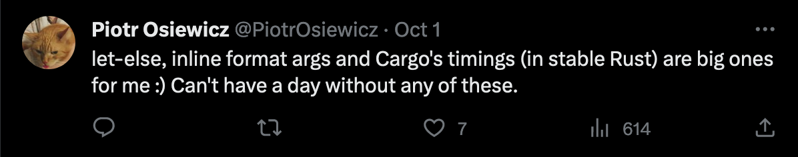

class: center
name: title
count: false

# Rust: when the details matter

.p60[]

.me[.grey[*by* **Nicholas Matsakis**]]
.left[.citation[View slides at `https://nikomatsakis.github.io/eurorust-2023/`]]

---

# Who am I?

.row[
.column40[]
.column60[
* Involved in Rust since 2010
* Co-lead of Rust language design team
* Manager of Rust team at Amazon
]
]

???

Hi! My name is Niko Matsakis. I've been working in Rust a long time, and so I expect some of you know who I am already, but for the rest of y'all, let me introduce myself.

I started working on Rust in 2010. This wasn't actually the **beginning**. As you probably know, Rust goes back further. For example, I never used `rustboot`, the very first Rust compiler implemented in O'caml. But I was involved in the very first 0.1 release of Rust -- I got 64-bit support working. 

Since then, I've been involved in a lot of other things. I was the first lead of the Rust compiler team and was involved in the Rust core team, back when that was a thing. At this point though my primary role is as co-lead of the Rust language design team.

Since 2021, I've been working at Amazon, where I manage our Rust team. As some of you may know, Amazon's been making very heavy use of Rust. At this point, every S3 GET request, every Lambda invocation, and a good number of other things make use of services implemented in Rust. Being at Amazon has been a really interesting experience, since it lets me work very closely with the teams here, figuring out exactly where Rust can help them -- and where it holds them up. 

---

# Rust adoption

--

* Rust in the cloud

--

* Rust in kernels

--

* Rust in **your** workplace?

---

# Why do people use Rust?

In my experience, this is the wrong question.

???

I want to 

---

# Why do people *start* using Rust?

In a word: **efficiency**

--


???


---

# Why not something else?

In a word: **risky**

--


---

# Why do people *keep* using Rust?

In a word, **reliability**

--

.p40[]

---

# I'm not the first to observe this


???

Now, I'm not the first to see this. There's a great presentation by Ashley Williams -- speaking tomorrow at this conference! -- talking about her experience advocating for Rust at npm, and she makes the same observation.

By the way, if you're one of those people who would like to see Rust being used at their workplace, but isn't sure how to advocate for it, I recommend checking out her talk -- it's great!

---

# Rust 2024 is coming


???

The title of this talk is Rust 

---

# Rust editions in a nutshell

"Breaking changes where no code breaks"

* Every crate declares its *Rust edition*

--
* Compiler understands *all* editions

--
* Editions interoperate

---

# Rust editions are also an opportunity to reflect

"Gather round Rustaceans, and I'll tell you a tale"

.p60[]

---

# Let-else

.p60[]

---

# Let-else

.p60[]

--
.p60[]
.p60[]
.p60[]

---

# Before let-else

```rust
fn process_data() -> Option<Data> { }

fn make_decision() -> bool {
    if let Some(data) = process_data() {
        do_stuff_with(data)
    } else {
        false
    }
}
```

.line5[]

---
name: after-let-else

# After let-else

```rust
fn process_data() -> Option<Data> { }

fn make_decision() -> bool {
    let Some(data) = process_data() else {
        return false;
    };

    do_stuff_with(data)
}
```

---
template: after-let-else

.elsekw[]

???

Now you can put this `else` keyword...

---
template: after-let-else

.line5[]

???

...and you can move the "unlikely case" here

---
template: after-let-else

.line8[]

???

...with the happy path being unindented.

---