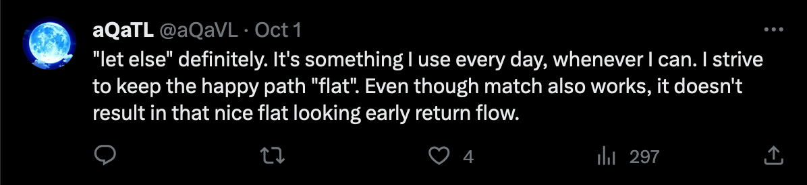

class: center
name: title
count: false

# Rust: when the details matter

.p60[]

.me[.grey[*by* **Nicholas Matsakis**]]
.left[.citation[View slides at `https://nikomatsakis.github.io/eurorust-2023/`]]

---

# Who am I?

.row[
.column40[]
.column60[
* Involved in Rust since 2010
* Co-lead of Rust language design team
* Manager of Rust team at Amazon
]
]

???

Hi! My name is Niko Matsakis. I've been working in Rust a long time, and so I expect some of you know who I am already, but for the rest of y'all, let me introduce myself.

I started working on Rust in 2010. I was involved in the very first public release of Rust, 0.1. We've come a long way since those days! As one tiny exmaple, when I started, Rust was 32-bit only. My first contribution, as I recall, was implementing support for 64-bit systems. Good times. Since then, I've been involved in a lot of other things. I was the first lead of the Rust compiler team and was involved in the Rust core team, back when that was a thing. At this point though my primary role is as co-lead of the Rust language design team.

Since 2021, I've been working at Amazon, where I manage our Rust team. This is a team of folks whose full-time job is to contribute to the Rust project, Tokio, and other parts of the ecosystem. As some of you may know, Amazon's been making very heavy use of Rust. At this point, every S3 GET request, every Lambda invocation, and a good number of other things make use of services implemented in Rust. Being at Amazon has been a really interesting experience, since it lets me work very closely with the teams here, figuring out exactly where Rust can help them -- and where it holds them up. We can then take those lessons, mix them with the experiences of others in other contexts, and find ways to make Rust better for everyone.

---

# Rust adoption

## Daily downloads

.p100[]

## Number of users/teams owning a crate

.p100[]

.footnote[
    Images from [lib.rs/stats](https://libs.rs/stats)
]

???

The last 10 years have been a wild ride! 

Rust has gone from this little toy language to a key part of the industry.

When I said I work on Rust, people used to give me a weird look. "I thought you said you were a programmer. Are you a chemist?"

Not so true anymore. More and more, people tend to respond, "Oh, hey, we're using Rust for something at work!" 

---

# Rust adoption

.p80[]

???

I mean heck, we even have the US congress weighing in on Rust now and, if I recall correctly, probing whether the nightly or stable toolchain is a better choice.
---

# Rust adoption

.p80[]

???

Of course, the watershed moment was when Rust appeared in the batgirl comic in 2017.
Boom, our job is done!

--

.batgirlcircle[&nbsp;]

???

Oh, and I'd like to callout that she says Rust is not complicated. Thanks batgirl comic authors! 
I like this PR.

---

# Rust adoption

* Rust in the cloud

???

We are seeing Rust in the cloud. Both to build the cloud itself, like at (hello!) Amazon and Microsoft, but also to build things *in* the cloud. A lot of people are finding that writing their cloud apps in Rust is a good choice. It saves them money. It requires less beefy machines and runs more reliably. 

--

* Rust in kernels

???

We are seeing Rust in kernels -- Rust for linux? Amazing. Windows kernel? Amazing. 

Rust was designed to be versatile, usable for high-level and low-level applications alike, and seeing it stretch from the machine kernel up to distributed applications in the cloud is a really cool validation of that design.

--

* Rust in **your** workplace?

???

For more and more people, working in Rust is a reality. 
If you're using Rust in your workplace, I'd love to hear about it after the talk.
But maybe you're not yet, and you'd like to be.
Or maybe you yourself are not convinced, and you'd like to know what all the fuss is about.

---

# Why do people use Rust?

In my experience, this is the wrong question.

???

I want to 

---

# Why do people *start* using Rust?

In a word: **efficiency**

--


???


---

# Why not something else?

In a word: **risky**

--


---

# Why do people *keep* using Rust?

In a word, **reliability**

--

.p40[]

---

# I'm not the first to observe this


???

Now, I'm not the first to see this. There's a great presentation by Ashley Williams -- speaking tomorrow at this conference! -- talking about her experience advocating for Rust at npm, and she makes the same observation.

By the way, if you're one of those people who would like to see Rust being used at their workplace, but isn't sure how to advocate for it, I recommend checking out her talk -- it's great!

---

# What's next for Rust?

.p80[]

---

# The Rust 2024 Edition is coming


???

---

# Rust editions in a nutshell

"Breaking changes where no code breaks"

* Every crate declares its *Rust edition* (e.g., `edition = "2024"`)

--
* Compiler understands *all* editions

--
* Editions interoperate (we never split the ecosystem)

--
* Adopting the newest edition is automated
    * Just run `cargo fix --edition`

--

What all this means:

* Upgrade on **your schedule, not ours**
    * (and not your dependencies' either)

---

### Rust editions let us make good on our promises...

# "Stability without stagnation"

???

Ever since 1.0, we've had "stability without stagnation" as one of our goals.

In short, we want to offer you a stable, reliable platform to build on.

But we also know that anything which *stands still* eventually bitrots and dies.

So we want Rust to keep evolving.

We resolve this tension in a bunch of ways.

It's one of the reasons we have a minimal standard library, preferring instead to let the ecosystem evolve.

It's why we do rolling releases every 6 weeks, which is pretty unusual for a programming language.

And it's why we do editions, which let us fix our mistakes, but don't force you to pay for them.

---

# Rust editions are also an opportunity to reflect

"Gather round Rustaceans, and I'll tell you a tale"

.p60[]

---

# Let-else

.p60[]

---

# Let-else

.p60[]

--
.p60[]
.p60[]
.p60[]

---

# Before let-else

```rust
fn process_data() -> Option<Data> { }

fn make_decision() -> bool {
    if let Some(data) = process_data() {
        do_stuff_with(data)
    } else {
        false
    }
}
```

.line5[]

---
name: after-let-else

# After let-else

```rust
fn process_data() -> Option<Data> { }

fn make_decision() -> bool {
    let Some(data) = process_data() else {
        return false;
    };

    do_stuff_with(data)
}
```

---
template: after-let-else

.elsekw[]

???

Now you can put this `else` keyword...

---
template: after-let-else

.line5[]

???

...and you can move the "unlikely case" here

---
template: after-let-else

.line8[]

???

...with the happy path being unindented.

---

# How an idea becomes a feature

.pathrfc[]

--
.pathrfcimpl[]
.pathimpl[]

--
.pathimplstab[]
.pathstab[]

--

.pathdocs[]

--

.pathtemps[]

--

.pathfmt[]

--

.pathstabfcp[]
.pathfcp[]

---

# Credit where credit is due

.pathcredit[.thanks[]]

--

.credit1[]
.credit2[]
.credit3[]

--

.pathcredit2[
...plus `@ytmimi` who wrote the rustfmt impl!
]
.credit4[]

---

# More goodness

.p48[]

--
.p48[]

--
.p48[]

--
.p48[]


--
.p48[]

---

# And my personal favorite...

.p80[]

.footnote[
    Consider the rust-analyzer [Open Collective](https://opencollective.com/rust-analyzer).
]

---

# Async I/O in Rust

Ever since Rust 1.39 was released in Nov 2019...

```rust
async fn handle(r: Request) -> Response {
    ... do_stuff().await ...
}
```

--

This is actually sugar for...

```rust
fn handle() -> impl Future<Output = Response> {
    async move {
        ... do_stuff().await ...
    }
}
```

---

# But async fn and impl Trait are limited

```rust
trait Handler {
    async fn handle(r: Request) -> Response; // 💥
}

trait Handler {
    fn handle(r: Request) -> impl Future<Output = Response>; // 💥
}

impl Handler {
    async fn handle(r: Request) -> Response { // 💥
        ... do_stuff().await ...
    }
}
```


.footnote[
    PSA: You can use [the `#[async_trait]` crate](https://crates.io/crates/async-trait) to workaround this today.
]

--

.line2[]

.line6[]

.line10[]

???

But as of today, async functions (and impl Trait return types) can only be used in very limited places. 

In particular, you can't use them in traits. 

This is a major stumbling block for new users, who innocently write the syntax only to get an error.

There is a workaround: there's a crate that you can use to simulate async functions in traits, and the compiler even suggests it.

That's ok, but (a) you really shouldn't have to reach for a crate for core functionality like this

and (b) the techniques the async-trait crate uses are not workable for all scenarios. 

Lack of async fn in traits is a big blocker to the development of a rich async ecosystem.

Crates like Tower, which defines a generic middleware interface, are much more complex and not able to reach 1.0 status.

The standard library can't add interop traits for things like reading and writing of streams.

The list goes on.

---
name: rust1.75

# When Rust 1.75 is released on Dec 28...

```rust
trait Handler {
    async fn handle(r: Request) -> Response;  // ⚠️
}

trait Handler {
    fn handle(r: Request) -> impl Future<Output = Response>; // ✅
}

impl Handler {
    async fn handle(r: Request) -> Response { // ✅
        ... do_stuff().await ...
    }
}
```

---

template: rust1.75

.line6[]

.line10[]

---

template: rust1.75

.line2[]

???

But all of that is changing! As of Rust 1.75, both async functions and impl trait are accepted within traits!

And of course it also works in impls.
In fact, because `async fn` is just sugar for returning `impl Future`, you can mix and match.
So the impl here could be used with either of the above trait definitions.

---

# What's this mean?

```rust
trait Handler {
    fn handle(r: Request) -> impl Future<Output = Response>;
}

async fn handle(h: impl Handler, r: Request) {
    h.handle(r).await
}
```

.line5[]

???

In short, things mostly work like you expect.
You can write traits that return futures.
You can write generic code that uses those traits and call methods.
You can also write traits that return other things, like iterators, closures, etc.

---

# What's this warning about?

```rust
trait Handler {
    async fn handle(r: Request) -> Response;  // ⚠️
}
```

???

You may recall that, earlier, I said that using an `async fn` in a trait was allowed, but you got a warning.
Why is that?
Well, it's because there are still key limitations to async functions that we'd like to resolve we say that they are ready for widespread use.

---

name: send-bounds

# Send bounds

```rust
trait Handler {
    async fn handle(r: Request) -> Response;
}

async fn handle_spawn(h: impl Handler, r: Request) {
    tokio::spawn(async move {
        h.handle(r).await // 💥 `h` is not `Send`!
    });
}
```

???

The biggest limitation is send bounds.
Suppose that you wanted to to take that same `handle` function,
but you wanted to execute it in another task.

---
template: send-bounds

.line6[]


???

You might invoke `tokio::spawn` to do that.

---

template: send-bounds

.line7[]

???

But if you try that, you're going to get an error. The problem is that `h` can be any type that implements `Handler`, but spawn requires types that are sendable and static. OK, you think, I can handle this.

---

name: send-bounds-1

# Send bounds

```rust
trait Handler {
    async fn handle(r: Request) -> Response;
}

async fn handle_spawn(h: impl Handler + Send + 'static, r: Request) {
    tokio::spawn(async move {
        h.handle(r).await // 💥 future returned is not `Send`!
    });
}
```

---

template: send-bounds-1

.line5[]

???

Just update the bounds on `h` to use `Send + 'static`, right? Now it must be a handler that is also sendable across threads and which contains no references.

---

template: send-bounds-1

.line6[]

???

Wrong. You still get an error! Why is that? Well, the problem is that, when you call the method `handle`, you get back a future -- and *that future* is not sendable. So what you really want to be able to do is to say that you want *the future returned by handle* to be `Send`.

---

# One way to fix this

```rust
trait Handler {
    fn handle(
        r: Request
    ) -> impl Future<Output = Response> + Send;
}
```

.line4[]

??? 

One way to fix this is to update the trait definition.
This is fine for some use cases, but not for all.
Sometimes you want a trait that *may* return send futures but *may not*.

---

# Future work

```rust
trait Handler {
    async fn handle(r: Request) -> Response;
}

async fn handle_spawn(h: impl Handler + Send + 'static, r: Request) {
    tokio::spawn(async move {
        h.handle(r).await // 💥 future returned is not `Send`!
    });
}
```

---

# Why stabilize async functions now?

???

You may wonder why we didn't just wait until everything was perfect. 
This was, in fact, controversial.
But remember Rust's goal: stability without stagnation.
Nothing is ever truly done, so when something is ready and usable, we want to get it into your hands, even if there is still more to come.
In particular, async functions in their current form are still good enough for a lot of use cases.


---

# Role of editions

---

# Where to from here?

---

# Where to from here?
